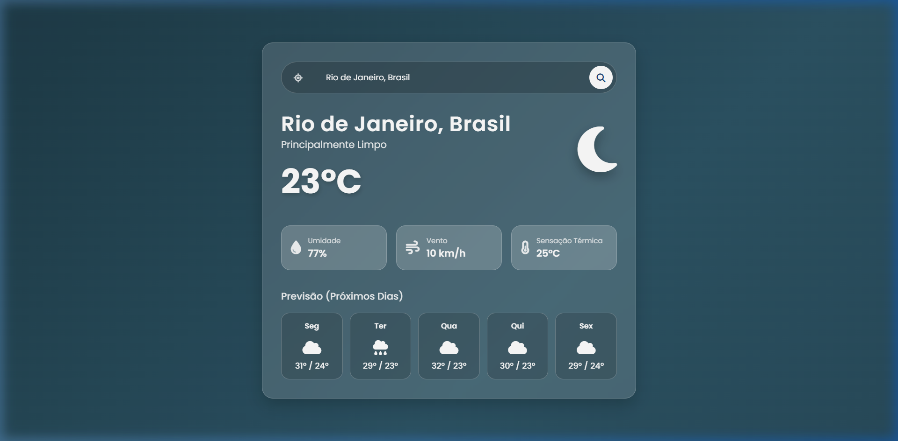
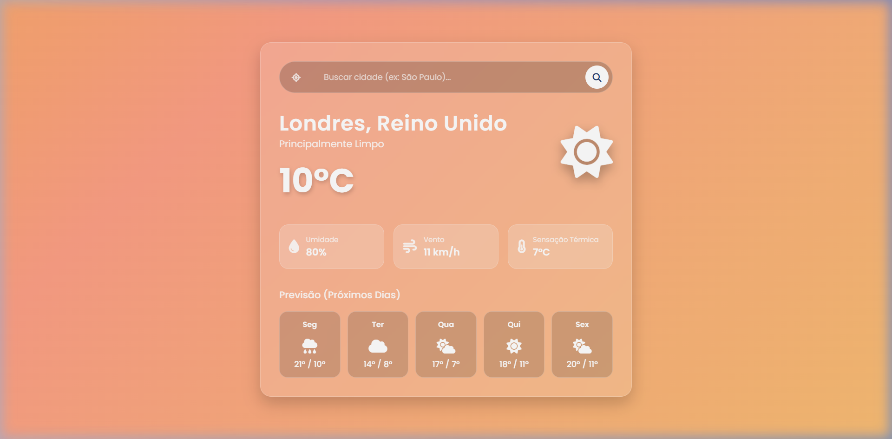
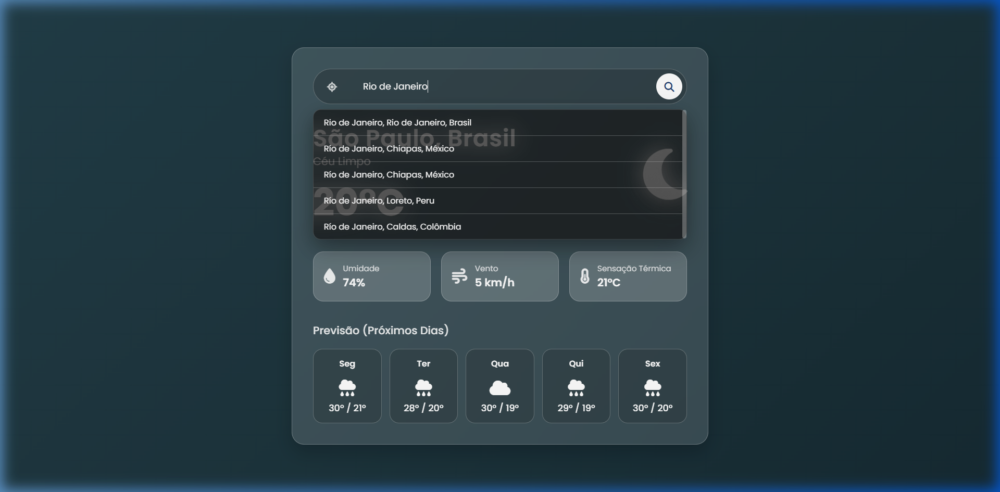
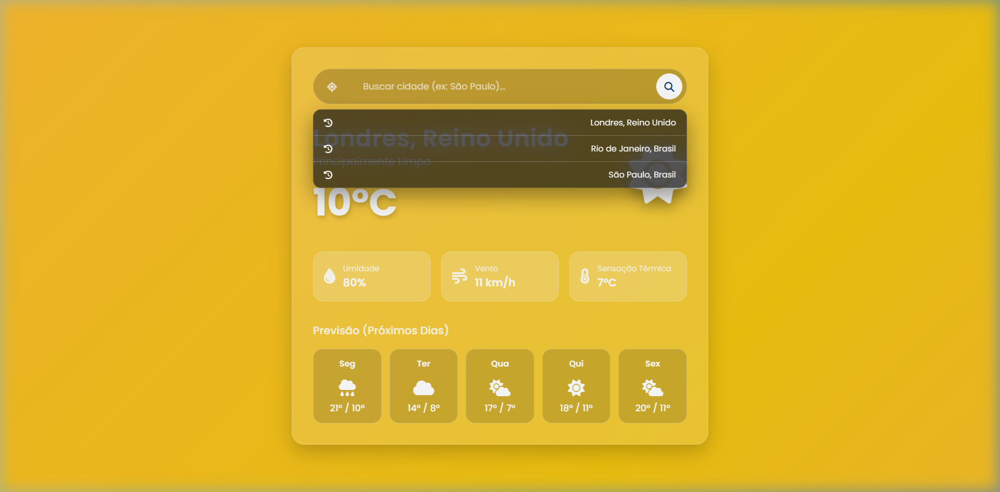

# Weather Dashboard 🌤️

*Choose your language / Escolha seu idioma:*
[🇺🇸 English](#English) | [🇧🇷 Português](#Portugues)

---

## English

A modern and responsive weather dashboard developed as part of a technical portfolio. This application provides real-time weather conditions and forecasts using the **Open-Meteo API**. The interface features a dynamic glassmorphism design that adapts to different weather conditions (sunny, cloudy, rainy, and night) and includes features such as search functionality, geolocation, autocomplete suggestions, and a history of recent searches.

### ✨ Features
- **Real-time Weather Data**: Fetches current weather conditions and 5-day forecasts.
- **Geolocation API**: Uses the browser's native API to detect the user's current location with a single click.
- **Autocomplete Suggestions**: Suggests city names worldwide as the user types (with debounce).
- **Dynamic Themes**: The background gradients and colors automatically adjust based on the current weather conditions (Sunny, Cloudy, Rainy, Night).
- **Recent Searches**: Saves the latest searches using `localStorage` for quick access.
- **Security**: Hardened with Content Security Policy (CSP) and XSS prevention (using strict DOM manipulation).

### 🛠️ Technologies Used
- **HTML5** & **CSS3** (Custom Glassmorphism styling, no frameworks)
- **JavaScript (Vanilla)** (ES6+, Async/Await)
- **[Open-Meteo API](https://open-meteo.com/)**: Weather data and Geocoding.
- **[BigDataCloud API](https://www.bigdatacloud.io/)**: Free Reverse Geocoding.

### 🚀 Local Setup
1. Clone the repository: `git clone <repository-url>`
2. Open the folder and launch `index.html` in your favorite web browser (or use VSCode Live Server).
3. No API keys are required!

---

## Portugues

Um dashboard de clima moderno e responsivo, desenvolvido como parte de um portfólio técnico. Esta aplicação fornece condições climáticas em tempo real e previsões utilizando a **Open-Meteo API**. A interface apresenta um design dinâmico em *glassmorphism* que se adapta a diferentes condições climáticas (ensolarado, nublado, chuvoso e noite) e inclui funcionalidades avançadas como busca, geolocalização nativa, sugestões de preenchimento automático (autocomplete) e histórico de pesquisas.

### ✨ Funcionalidades
- **Dados em Tempo Real**: Busca as condições climáticas atuais e previsão para 5 dias.
- **Geolocalização (GPS)**: Utiliza a API nativa do navegador para detectar a localização atual do usuário com um clique.
- **Autocomplete (Sugestões)**: Sugere nomes de cidades pelo mundo enquanto o usuário digita na barra (utilizando técnica de *debounce*).
- **Temas Dinâmicos**: As cores e gradientes do fundo da tela se ajustam automaticamente baseados no clima (Sol, Chuva, Nublado ou Noite).
- **Pesquisas Recentes**: Salva automaticamente as últimas cidades buscadas usando o `localStorage` do navegador para acesso rápido.
- **Segurança**: Protegido com Política de Segurança de Conteúdo (CSP) e prevenção contra XSS (usando manipulação estrita do DOM).

### 🛠️ Tecnologias Utilizadas
- **HTML5** & **CSS3** (Estilização *Glassmorphism* pura, sem frameworks)
- **JavaScript (Vanilla)** (ES6+, Async/Await)
- **[Open-Meteo API](https://open-meteo.com/)**: Dados meteorológicos e Geocodificação (busca de cidades).
- **[BigDataCloud API](https://www.bigdatacloud.io/)**: Geocodificação reversa gratuita (latitude/longitude para nome de cidade).

### 🚀 Como Rodar Localmente
1. Clone este repositório: `git clone <repository-url>`
2. Abra a pasta e inicie o arquivo `index.html` diretamente no seu navegador (ou use o Live Server do VSCode).
3. Não é necessário configurar chaves de API (API Keys)!
